<!-- نسخهٔ فارسی پروفایل -->

  <a href="./README.md">🇬🇧 English</a> &nbsp;·&nbsp; <b>🇮🇷 فارسی</b>

  

  
  
  

---

## 👋 درباره من

توسعه‌دهنده فول‌استک و متخصص DevOps با تجربه در طراحی، توسعه و استقرار پلتفرم‌های تحت وب **مدرن، مقیاس‌پذیر و امن**. از خط اول کد تا محیط پروداکشن — همه‌چیز را خودم مدیریت می‌کنم.

تخصص من فقط «ساختن» نیست؛ **معماری درست، استقرار بدون دردسر، مانیتورینگ هوشمند و نگهداری بلندمدت** بخش جدانشدنی کاری است که ارائه می‌دهم. کسب‌وکارها با من یک تیم فنی کامل دارند، نه فقط یک کدنویس.

| 🚀 توسعه محصول | ☁️ زیرساخت و DevOps | 🔐 امنیت و کیفیت |
|---|---|---|
| سامانه‌های سازمانی اختصاصی | Pipeline کامل CI/CD | JWT · OAuth2 · SSO |
| پلتفرم‌های SaaS چندمستأجره | Docker + Kubernetes | کنترل دسترسی مبتنی بر نقش (RBAC) |
| فروشگاه و تجارت الکترونیک | Terraform / Ansible (IaC) | امنیت API · Rate limiting |
| CRM و داشبورد مدیریتی | Prometheus · Grafana · ELK | بهینه‌سازی و مقیاس‌پذیری |
| پلتفرم آموزشی LMS | AWS / Hetzner / VPS | Backup · Rollback · Zero-downtime |
| API های REST و Real-time (WebSocket) | Staging → Pre-prod → Production | |

---

## 🏗️ معماری پروداکشن

  

---

## 🗑️ چرا وردپرس نه؟

  

> قالب آماده و پلاگین روی پلاگین، یعنی بدهی فنی از روز اول. من هر محصول را **اختصاصی** می‌سازم:
> کدی که مالکش خودت هستی، بدون قفلِ افزونه، با امنیت و کارایی و مقیاس‌پذیریِ واقعی.

---

## 🛠️ استک فنی

**بک‌اند**

 REST API · WebSocket · Microservices

**فرانت‌اند**

**دیتابیس و کش**

**DevOps و زیرساخت**

**معماری و امنیت** · معماری ماژولار / میکروسرویس · JWT · OAuth2 · RBAC · استقرار بدون قطعی · Infrastructure as Code

---

## 📂 نمونه کارها

| پروژه | توضیح | لینک |
|---|---|---|
| **ستاد یار** | سامانه مدیریت سازمانی | <https://app.setadyar.com> |
| **آراکا** | پلتفرم تحت وب | <https://app.arakaco.com> |
| **کارلی شاپ** | فروشگاه اینترنتی | <https://karlycollection.com> |
| **آنلاین پیامک** | سرویس پیامکی | <https://onlinepayamak.com> |
| **زاگرس تک** | وب‌سایت شرکتی | <https://zagrostech.ir> |
| **اکستنشن کروم ایران‌خودرو دیزل** | افزونه فروش | <https://esale.ikd.ir> |

---

## 📊 آمار گیت‌هاب

  
  

  

  

  

---

## 🎯 رویکرد کاری

با من وارد یک **همکاری بلندمدت** می‌شوید، نه یک پروژه یک‌بارمصرف. از تحلیل نیاز و معماری اولیه تا استقرار روی سرور، مانیتورینگ و توسعه مداوم — چرخهٔ کامل محصول را پوشش می‌دهم.

> محصولی که تحویل می‌دهم: **پایدار، مستند، قابل توسعه — و آماده رشد با کسب‌وکار شما.**
