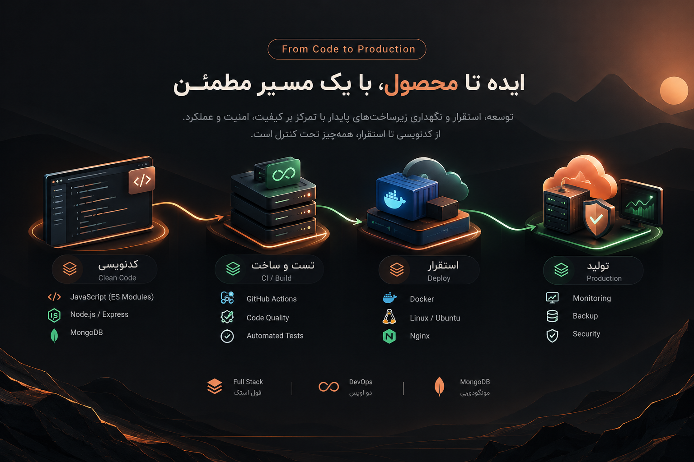

  <a href="./README.fa.md">🇮🇷 فارسی</a> · <b>🇬🇧 English</b>

  

  
  

## 👋 About

**Full Stack Web Developer & DevOps Engineer** focused on building custom, secure and maintainable web platforms.

I work across the full lifecycle: architecture, backend development, frontend integration, deployment, maintenance and performance. The goal is simple — **clean engineering that stays useful after launch.**

## 🧩 What I build

| Product Engineering | Infrastructure & DevOps | Security & Reliability |
|---|---|---|
| Custom web platforms | Linux / VPS deployment | JWT / Session / RBAC |
| SaaS & multi-tenant systems | CI/CD & release workflows | API security & rate limiting |
| CRM, dashboards & business tools | Docker & Nginx | Backup / rollback strategies |
| E-commerce & internal systems | Monitoring & maintenance | Performance & scalability |
| REST APIs & real-time features | Cloud / server operations | Modular architecture |

## 🛠️ Core stack

**Backend:** Node.js · Express · NestJS · JavaScript · TypeScript · REST API · WebSocket  
**Frontend:** HTML · CSS · JavaScript · responsive interfaces  
**Database:** MongoDB  
**DevOps:** Linux · Docker · Nginx · GitHub Actions · Cloudflare · VPS  
**Engineering:** Modular Architecture · RBAC · JWT · Session Auth · API Security · Performance Optimization

## 📂 Selected work

| Project | Focus | Link |
|---|---|---|
| **ستاد یار** | سازمانی / CRM / مالی | https://app.setadyar.com |
| **آراکا** | پلتفرم تحت وب | https://app.arakaco.com |
| **کارلی شاپ** | E-commerce | https://karlycollection.com |
| **آنلاین پیامک** | پیامک و پنل خدماتی | https://onlinepayamak.com |
| **زاگرس تک** | Industrial / corporate platform | https://techzagros.ir |

## 🎯 Working approach

I prefer long-term, maintainable solutions over one-off delivery: **understand → architect → build → deploy → maintain → improve.**

> **Build it right. Keep it maintainable. Make it ready to grow.**
